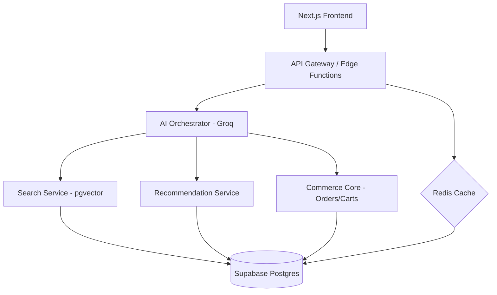

# LUXE: AI-Native E-Commerce Architecture

## High-Level Architecture

## Database Schema Highlights
- **Products & Embeddings**: HNSW indexed pgvector for semantic retrieval.
- **Conversations & Messages**: Persistent chat history with intent metadata.
- **Carts & Orders**: Grounded commerce core for AI-driven transactions.
- **AI Events**: Observability for latency, tokens, and confidence scores.
- **Recommendation Logs**: Tracking of AI-driven decisions and match scores.

## AI Pipeline
1. **Intent Extraction**: Groq (Llama 3.3) identifies user goals (search, compare, buy).
2. **Retrieval**: Hybrid search (Vector + Keyword) using `transformers.js` for embeddings and `pgvector` for similarity.
3. **Decision Engine**: Reranking and tradeoffs analysis to select 1 primary + 2 alternatives.
4. **Grounded Response**: Response generated using catalog data and technical specs.

## Scaling Strategy
- **Read Replicas**: Use Supabase read replicas for heavy product catalog traffic.
- **Embedding Cache**: Redis caches embeddings to avoid redundant CPU-heavy generation.
- **Vector Indexing**: Use HNSW indexes for sub-300ms retrieval at scale.
- **Horizontal Scaling**: Next.js App Router on Vercel/Edge for global low latency.

## Failure-Mode Strategy
- **Fallback**: If Vector search fails, fallback to traditional ILIKE keyword search.
- **Rate Limiting**: Redis-based sliding window rate limiting protects the AI Orchestrator from abuse.
- **Confidence Scoring**: If AI confidence < 0.7, trigger clarifying questions instead of making decisions.
- **Structured Output Enforcement**: JSON mode ensures valid payloads for tool calls.

## Cost Control
- **Semantic Caching**: Cache common search result sets in Redis.
- **Smaller Models**: Route simple queries (chat/info) to smaller, cheaper models.
- **Batching**: Batch embedding generation for bulk catalog updates.
